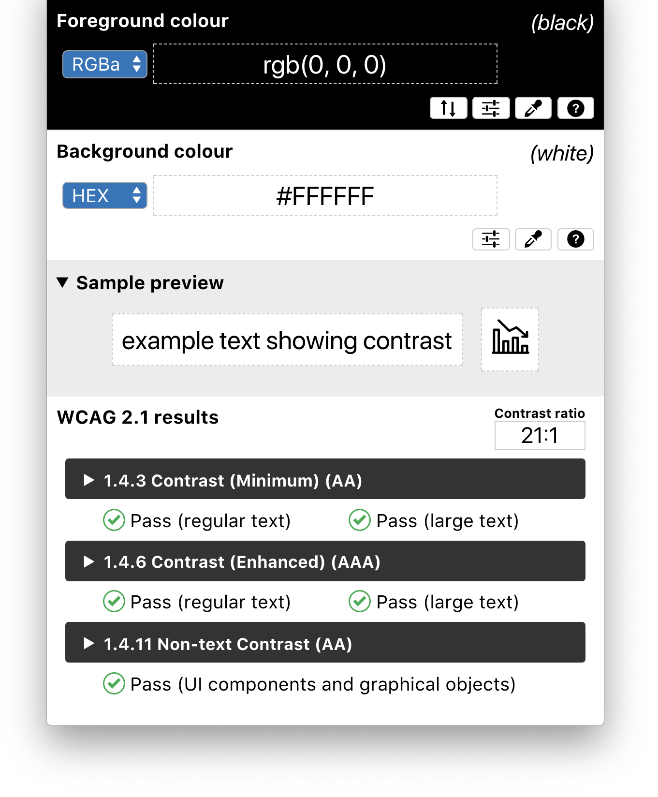

# CCA — independent development repository

This is an independently initialized copy, not a GitHub fork, of
[The Paciello Group / TPGi’s Colour Contrast Analyser](https://github.com/ThePacielloGroup/CCAe),
starting from the supplied 3.5.5 source archive. Credit belongs to TPGi,
Cédric Trévisan, and the original contributors. This copy is not an official TPGi release.
The original GPL license and notices are retained in `LICENSE` and the source.

## Local development

- Runtime: Electron 44.3.0 (macOS 13+; 64-bit platforms).
- Install: `npx yarn@1.22.22 install --frozen-lockfile`
- Run: `npm start`
- Build locally without publishing: `npm run build`
- Upstream update checks and release publishing are disabled in this independent copy.
- Signing/notarization must be configured with the new maintainer’s credentials before distribution.

The Colour Contrast Analyser (CCA) helps you determine the legibility of text and the contrast of visual elements, such as graphical controls and visual indicators.

This repository contains the source code for the new Colour Contrast Analyser (CCA) builds for Windows and macOS based on [Electron](https://electronjs.org/). For the previous, non-Electron versions ("CCA Classic"), see the [CCA-Win](https://github.com/ThePacielloGroup/CCA-Win) and [CCA-OSX](https://github.com/ThePacielloGroup/CCA-OSX) repositories.

For further information, see [TPGi's Colour Contrast Analyser resource page](https://www.tpgi.com/color-contrast-checker/).

## Features
- WCAG 2.1 compliance indicators
- Several ways to set colours: raw text entry (accepts any valid CSS colour format), RGB sliders, colour picker (Windows and macOS only)
- Support for alpha transparency on foreground colours
- Colour blindness simulator

## Known issues
- See the known issues for the latest [CCA release](https://github.com/ThePacielloGroup/CCAe/releases) and [confirmed bugs](https://github.com/ThePacielloGroup/CCAe/issues?q=is%3Aissue+is%3Aopen+label%3Abug)

## Contributing
If you have an idea for a new feature, or if you found a bug, please submit a GitHub issue. Please search the existing issues before submitting to
prevent duplicates.

If you want to contribute, please send a pull request and someone will review your code. Please
follow the [Contribution
Guidelines](CONTRIBUTING.md)
before sending your pull request.

## Contact
If you have any questions, feel free to open an issue here on GitHub.  

## License
  

Colour Contrast Analyser (CCA) is Free Software: You can use, study share and improve it at your
will. Specifically you can redistribute and/or modify it under the terms of the
[GNU General Public License](https://www.gnu.org/licenses/gpl.html) as
published by the Free Software Foundation, either version 3 of the License, or
(at your option) any later version.

> This program is distributed in the hope that it will be useful, but WITHOUT ANY WARRANTY; without even the implied warranty of MERCHANTABILITY or FITNESS FOR A PARTICULAR PURPOSE. See the GNU General Public License for more details.
